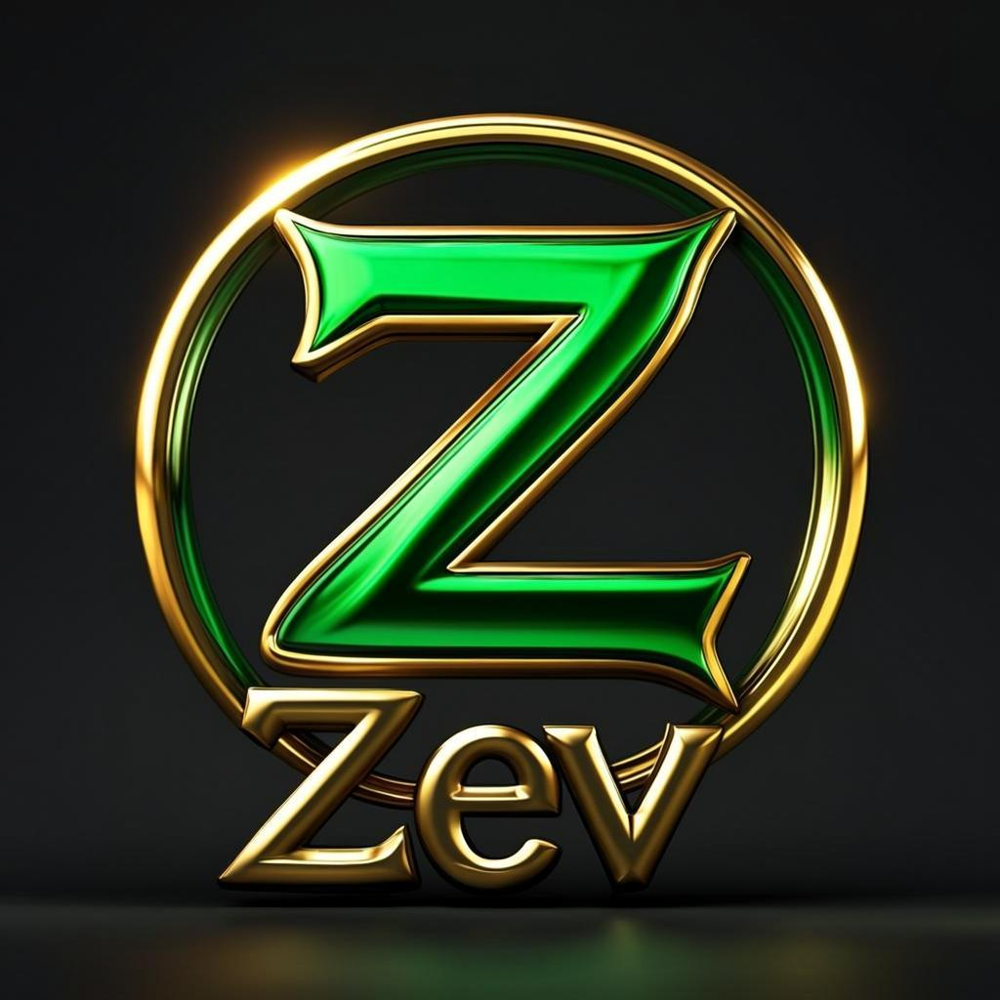

# Zev — Premium Discord Tools & Bots Marketplace

A professional development marketplace website built by **Arsh Raj Sharma**. Buy premium Discord bots, tools, and digital credentials with crypto (LTC/BTC/SOL/USDT). Payments are auto-verified on the blockchain — instant delivery, no middlemen.



## ✨ Features

- **Marketplace** — Paid & free Discord bots/tools with search and filters
- **Open Source Codes** — 100% free, MIT-licensed tools for the community
- **Stock & Accounts** — Credentials market (emails, accounts) with instant reveal after payment
- **Auto-Detect Payments** — Scans your crypto wallet on the blockchain every 8 seconds; delivers the product the moment a matching transaction appears (even pending)
- **Email Delivery** — Purchase confirmations sent to the buyer's email automatically
- **Admin Dashboard** — Upload products, stock, and open-source codes (admin-only, login required)
- **Auth System** — Email signup/login with auto-admin for the owner
- **3D UI** — Bubble translucent navbar, glassmorphism cards, aurora gradients, holographic borders

## 🛠 Tech Stack

- **Framework**: Next.js 16 (App Router) + TypeScript
- **Styling**: Tailwind CSS 4 + shadcn/ui
- **Database**: Prisma ORM (SQLite for dev)
- **State**: Zustand + TanStack Query
- **Animations**: Framer Motion
- **Email**: Nodemailer (Gmail SMTP)
- **Blockchain**: Native RPC calls (BTC/LTC/SOL/USDT-BEP20) — no paid APIs

## 🚀 Quick Start

### Prerequisites

- Node.js 18+ 
- Bun (recommended) or npm

### Installation

```bash
# Clone the repo
git clone <your-repo-url> zev
cd zev

# Install dependencies
bun install
# or: npm install
```

### Environment Setup

Create a `.env` file in the root:

```env
DATABASE_URL=file:./db/custom.db

# Email (Gmail) — get an App Password from:
# https://myaccount.google.com/apppasswords
SMTP_HOST=smtp.gmail.com
SMTP_PORT=587
SMTP_USER=arsh.raj.0713@gmail.com
SMTP_PASS=your-16-char-gmail-app-password
SMTP_FROM=arsh.raj.0713@gmail.com
SMTP_FROM_NAME=Zev
```

### Database Setup

```bash
# Push the Prisma schema to SQLite
bun run db:push

# Seed sample data (6 products, 4 stock items, 5 open-source codes)
curl -X POST http://localhost:3000/api/seed
# or start the server first, then visit /api/seed in your browser
```

### Run the Dev Server

```bash
bun run dev
```

Open [http://localhost:3000](http://localhost:3000) in your browser.

### Admin Login

The owner email gets **auto-admin** on signup. Sign up with:
- **Email**: `arsh.raj.0713@gmail.com`
- **Password**: `@rsh0712`

You'll be redirected to the admin dashboard automatically.

## 💳 Payment System

Zev supports 4 cryptocurrencies, all verified on-chain:

| Coin | Wallet | Explorer |
|------|--------|----------|
| **LTC** | `LhdpCbbxsqLtF7jssTGLWLYBKsnSgjTk3x` | litecoinspace.org |
| **BTC** | `bc1qhsrsqrvy4k9pxuyktn9xz7w8dt092lzd5xjeqs` | btcscan.org |
| **SOL** | `4i7hn4miHGiMFSceM5KfEc21VRwZ7AKAC5vFpds4GFv2` | solscan.io |
| **USDT** (BEP20) | `0xD21Db04f0895C8a715775796dAD28DA3c1c0c811` | bscscan.com |

**How it works:**
1. Buyer clicks "Buy Now" → enters email → picks a crypto
2. The checkout shows the exact address + amount to send
3. The server polls the blockchain every 8 seconds, scanning your wallet for a matching incoming transaction
4. The moment a matching tx is found (pending OR confirmed), the product is delivered instantly + emailed

To change the wallet addresses, edit `src/lib/config.ts`.

## 📦 Deployment on Vercel

See the **"Deploy to Vercel"** section below.

## 📁 Project Structure

```
zev/
├── prisma/
│   └── schema.prisma          # Database models (Product, StockItem, Order, User, etc.)
├── public/
│   └── img/                   # Generated images
├── src/
│   ├── app/
│   │   ├── api/               # API routes (products, stock, orders, auth, payments)
│   │   ├── layout.tsx         # Root layout
│   │   ├── page.tsx           # Main SPA (home, marketplace, checkout, etc.)
│   │   └── globals.css        # Tailwind + custom 3D/glass styles
│   ├── components/
│   │   ├── checkout/          # Checkout modal with auto-polling
│   │   ├── site/              # Navbar, footer, logo, cards, background
│   │   └── views/             # Home, products, stock, opensource, upload, about, auth
│   ├── lib/
│   │   ├── auth.ts            # Password hashing + token signing
│   │   ├── config.ts          # Wallets, payment methods, site config
│   │   ├── db.ts              # Prisma client
│   │   ├── email.ts           # Nodemailer email service
│   │   ├── payments.ts        # Blockchain wallet scanning (BTC/LTC/SOL/USDT)
│   │   └── store.ts           # Zustand store (routing, auth, checkout)
│   └── hooks/
│       └── use-data.ts        # TanStack Query hooks
├── .env                       # Environment variables (NOT committed)
├── .gitignore
├── LICENSE
└── README.md
```

## 📜 Scripts

| Command | Description |
|---------|-------------|
| `bun run dev` | Start dev server on port 3000 |
| `bun run build` | Build for production |
| `bun run lint` | Run ESLint |
| `bun run db:push` | Push Prisma schema to database |
| `bun run db:generate` | Regenerate Prisma client |

## 👤 Owner

**Arsh Raj Sharma** — [escapingdum(Arsh) on Discord](https://discord.gg/MAExCtnuu6)

- Org: Z Discord Tools/Bots Dev
- 1000+ vouches · 1573+ products sold

## 📄 License

MIT License — see [LICENSE](LICENSE) for details.

© 2026 Arsh Raj Sharma (Zev). All rights reserved.
